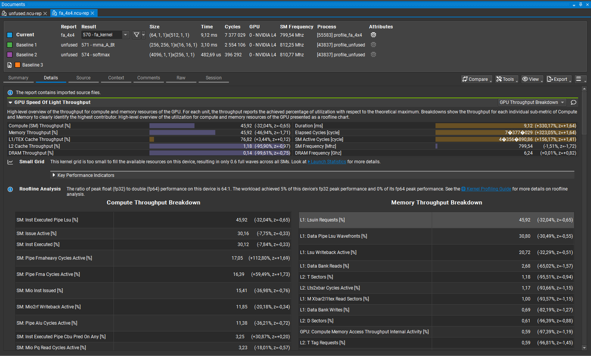
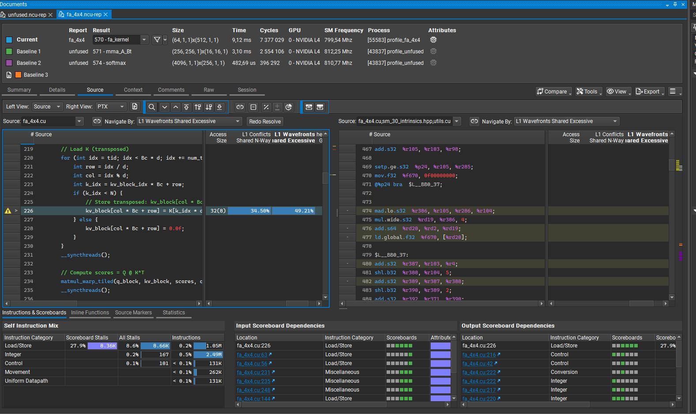
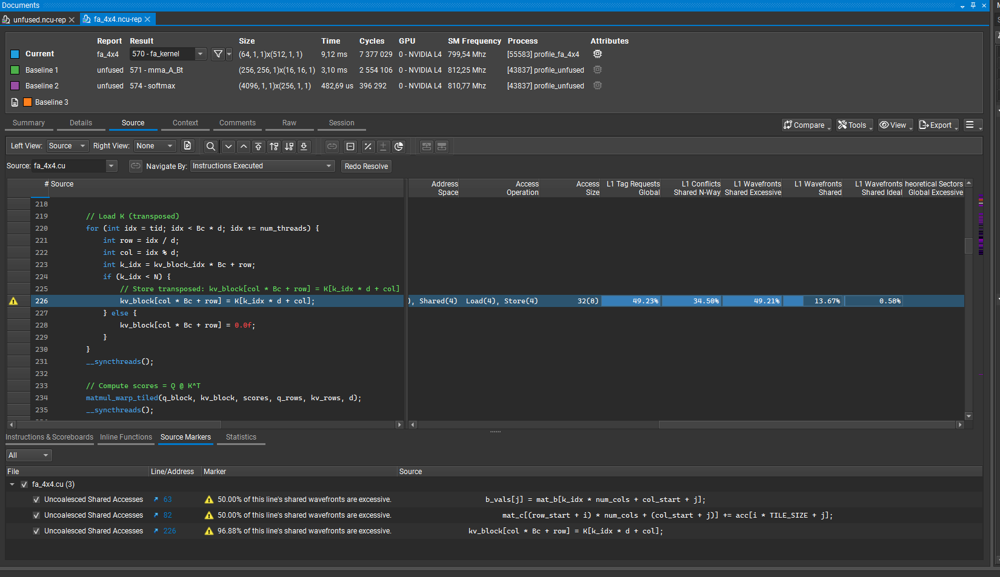
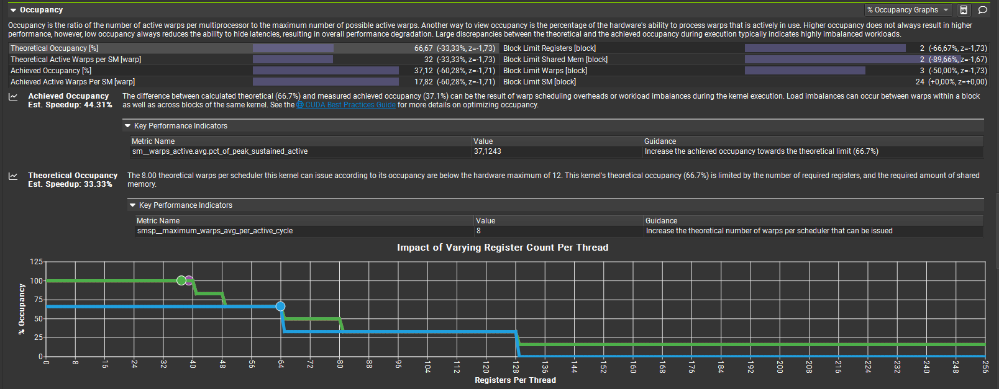
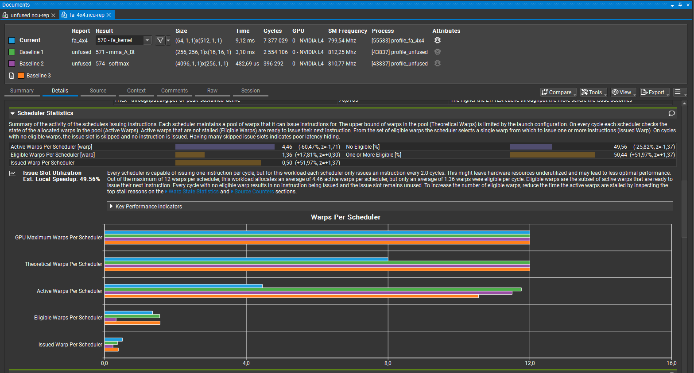
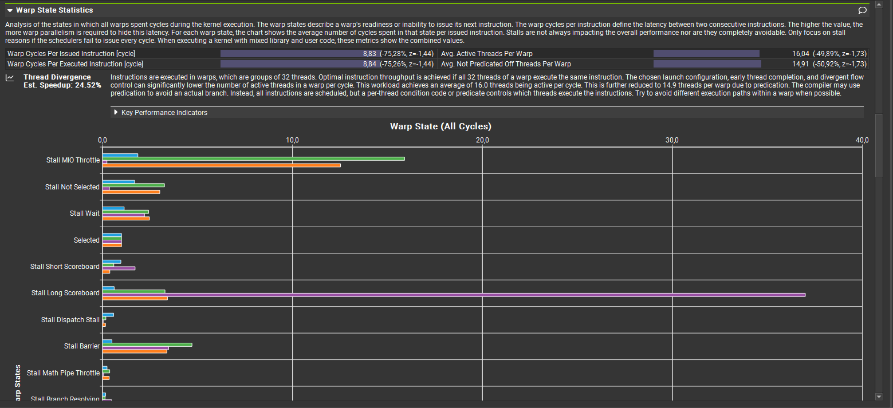

# Nsight Compute Analysis: fa_4x4 Flash Attention Kernel

## Summary of Top Optimization Opportunities

| Optimization | Est. Speedup | Primary Issue |
|---|---|---|
| Shared store bank conflicts | **53%** | 68.56% of shared stores have bank conflicts |
| Achieved occupancy | **44%** | 37.1% vs 66.7% theoretical |
| Theoretical occupancy | **33%** | Register and shared memory limits |

---

## I. Shared Store Bank Conflicts — Est. Speedup = 53%

### Overview
- **Load bank conflicts**: 15% of wavefronts affected  
- **Store bank conflicts**: 69% of wavefronts affected

The memory access pattern for shared stores is suboptimal, causing on average a **3.2-way bank conflict** across 8,413,440 shared store requests. This results in **18,351,117 bank conflicts**, representing **68.56%** of the overall 26,764,722 wavefronts for shared stores.

### Key Metrics

| Metric | Value | Interpretation |
|---|---|---|
| `l1tex__data_bank_conflicts_pipe_lsu_mem_shared_op_st.sum` | 1.83e+07 | Decrease shared store bank conflicts |
| `l1tex__throughput.avg.pct_of_peak_sustained_active` | 76.81% | Higher L1/Tex cache throughput amplifies issue |

### Impact on Performance

Memory throughput and L1 hit rates collapsed by ~99% compared to unfused kernels:


**Memory Throughput Breakdown** (46% vs 82–90% for unfused matmul kernels):



### Root Cause

**Single line of code** responsible for 50% of bank conflicts — transposed K tile store:

```cuda
kv_block[col * Bc + row] = K[k_idx * d + col];  // Non-coalesced access
```



Stores for B tile column and output accumulation also exhibit non-coalesced access patterns:



---

## II. Achieved Occupancy — Est. Speedup = 44%

### Overview

- **Active threads per warp**: Only 16 (vs 32 theoretical)
- **Theoretical warps per scheduler**: 8 (vs 12 hardware max)
- **Active warps per scheduler**: ~5 (vs 10–11 for unfused)

### Root Cause

Mismatch between theoretical (66.7%) and achieved (37.1%) occupancy due to:
- Warp scheduling overheads
- Load imbalances within and across blocks during kernel execution

See [CUDA Best Practices Guide](https://docs.nvidia.com/cuda/cuda-c-best-practices-guide/) for more details on occupancy optimization.

### Key Metric

| Metric | Value | Target |
|---|---|---|
| `sm__warps_active.avg.pct_of_peak_sustained_active` | 37.12% | ↑ Towards 66.7% theoretical |

### Visual Analysis

Theoretical and achieved active warps significantly decreased. Block limit per SM reduced to **2** due to register pressure (64 regs/thread) and large SRAM allocation (102 KB):



Although eligible and issued warps increased, performance did not improve:



Warp state statistics however improved across the board (side note: Stall Long Scoreboard outlier for the softmax kernel (purple)):



---

## III. Theoretical Occupancy — Est. Speedup = 33%

### Overview

This kernel's theoretical occupancy is **limited by resource constraints**, not by SM capacity.

### Limiting Factors

- **Registers per thread**: 64 (high pressure)
- **Shared memory per block**: 102 KB
- **Theoretical warps per scheduler**: 8 (below hardware max of 12)

### Key Metric

| Metric | Value | Implication |
|---|---|---|
| `smsp__maximum_warps_avg_per_active_cycle` | 8 | Increase register efficiency or reduce SRAM footprint |

---

## IV. Additional Observations

### IV.1 Resource Constraints

Large SRAM allocation (102 KB) + block size (512) + register pressure (64 regs/thread) create cascading inefficiencies:

- **Block residency**: Only 64 blocks total → ~1.1 blocks per SM (threshold is ≥2)
- **Waves per SM**: Only 0.55 (severely underutilized)
- **Occupancy**: 37% vs 90–100% for unfused kernels
- **Synchronization overhead**: `__syncthreads()` becomes a bottleneck with so few blocks

### IV.2 DRAM Activity Collapse

Active DRAM cycles dropped to **3–5%** compared to unfused kernels, indicating severe memory bandwidth underutilization despite the kernel being memory-bound overall.

---

## Summary

The fa_4x4 kernel demonstrates how **architectural constraints compound**:

1. **Bank conflicts** destroy shared memory throughput (68.56% of stores affected)
2. **Register pressure** limits occupancy to 37%, preventing sufficient wavefront hiding
3. **Small grid size** (64 blocks on 58 SMs) causes chronic underutilization
4. **Warp divergence** reduces effective thread parallelism from 32 to 16 per warp

Addressing any single issue without solving the others provides limited speedup. The interconnected nature of CUDA performance tuning is evident here.

For high level comparison of profiling results of `unfused` vs `fa_4x4` see: [ncu_highlevel.md](ncu_highlevel.md).