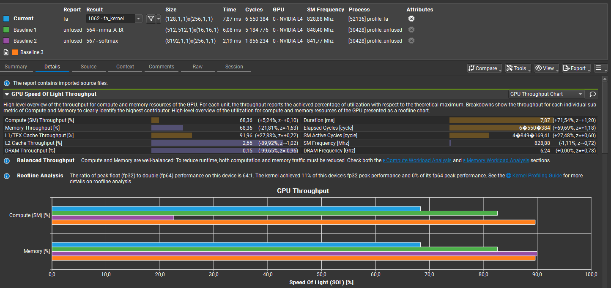
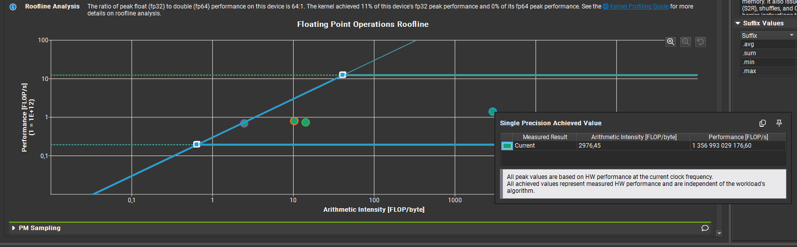
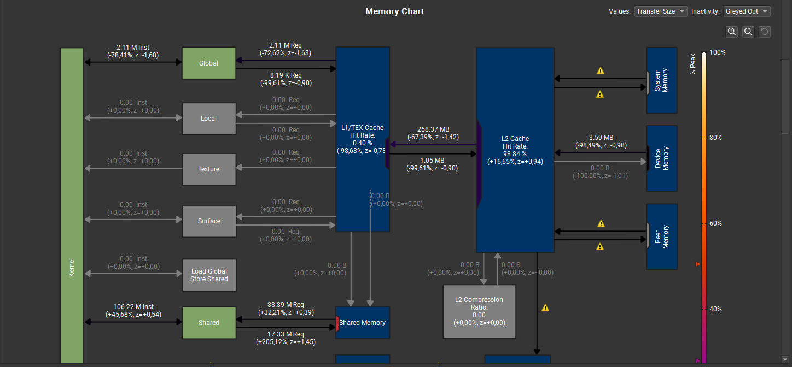
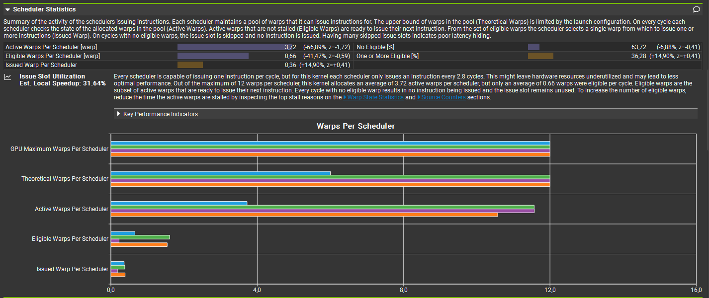
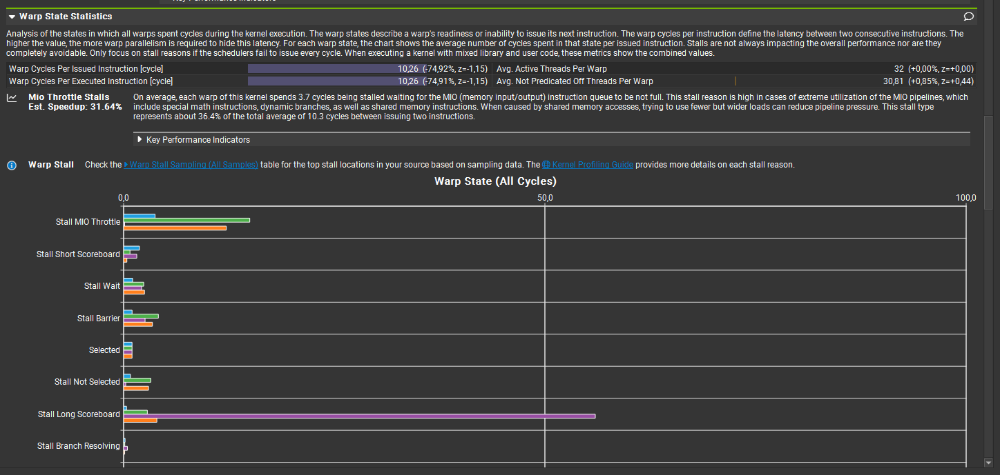
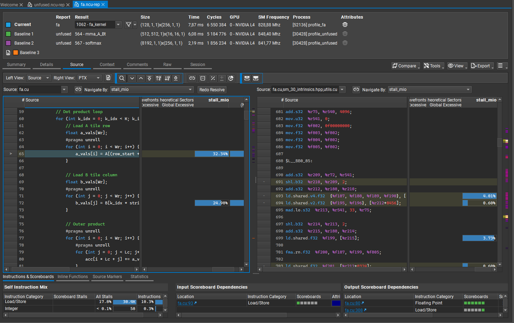
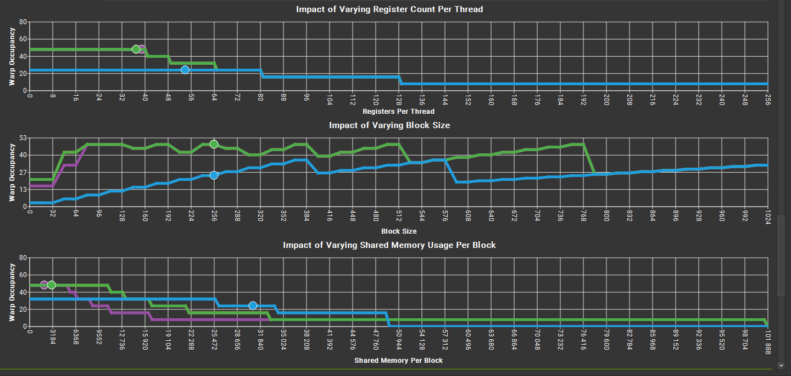

# Nsight Compute Profiling Details (Run 2)

## Extended Summary

Run 2 focused on optimizing the Flash Attention kernel to address bottlenecks identified in Run 1. Key improvements include:

- **Bank Conflict Removal**: Padding was introduced to eliminate shared memory bank conflicts, reducing shared store conflicts from 18M to 140K.
- **Unified Warp/Lane Work**: Each warp now handles `Wr` rows of Q, while each lane processes `Lc` columns within the `Wr x d` slice.
- **Removal of Warp Divergence**: Average Threads per Warp increased from `16` to `32`.
- **Shared memory reduction**: Exact SRAM array allocation allowed to increase the block limit per SM from `2` to `3`. 
- **Register Pressure Reduction**: Statically scoped variables were replaced with runtime values, leveraging compile-time constants and static assertions where possible.
- **Increased Sequence Length**: Sequence length was scaled from `N=4096` to `N=8192` to keep the device busy (increase the number of blocks from `64` to `128` and hence increase Waves per SM from `0.55` to `0.74`)

### Key Results

- **Latency Improvement**: Flash Attention latency is now 74% lower than the unfused baseline (41% higher in Run 1).
- **Throughput Increase**: Both compute & memory throughput increased 50% relative to `fa_4x4.cu`.
- **L2 Cache Efficiency**: Achieved a 99% L2 cache hit rate, minimizing DRAM accesses.
- **Remaining Bottlenecks**:
  - Mio throttle stalls (32% estimated speedup potential).
  - Occupancy capped at 50% due to SRAM usage and thread configuration.

Detailed analysis and profiling metrics are provided below, along with visualizations of key performance characteristics.

## Optimizations applied after Run 1

- removed bank conflicts via padding
- unified warp/lane work throughout the kernel - one warp handles Wr rows of Q, while one lane handle Lc columns within the Wr x d slice
- reduced register pressure by replacing statically scoped variables with run-time values with compile time constants and (static) asserts where possible
- increased sequence length N from 4096 to 8192 (recompared vs unfused for this setting).

## Summary of Next Optimization Opportunities

| Optimization | Est. Speedup | Primary Issue |
|---|---|---|
| Mio Throttle Stalls | **32%** | Largest bottleneck despite improved warp state stats |
| Occupancy | **32%** | 31% active vs 50% theoretical due to block and thread configuration |

---

## I. Mio Throttle Stalls — Est. Speedup = 32%

### Overview
- **Throttle stalls**: Significant delays due to memory instruction overheads.
- **Warp state improvements**: Reduced idle warps but stalls remain dominant.

### Key Metrics

| Metric | Value | Interpretation |
|---|---|---|
| `smsp__issue_active.avg.per_cycle_active` | 0.362786 | Increase the average number of instructions issued per cycle |
| `smsp_average_mio_throttle` | 3.73325 | Decrease the number of cycles spent in mio throttle stalls |

---

## II. Occupancy — Est. Speedup = 32%

### Overview
- **Block count per SM**: Limited to 3 due to SRAM usage.
- **Active threads per warp**: Only 16 (vs 32 theoretical).
- **Theoretical warps per scheduler**: 6 (vs 12 hardware max).
- **Active warps per scheduler**: ~3 (vs 6 for unfused).
- **Threads per block**: 256 threads, reducing warp availability.

### Root Cause

Mismatch between theoretical (50%) and achieved (31%) occupancy due to:
- SRAM usage limiting block count.
- Thread configuration (256 threads per block).

### Key Metric

| Metric | Value | Target |
|---|---|---|
| `sm__warps_active.avg.pct_of_peak_sustained_active` | 31.0175 | Increase the achieved occupancy towards the theoretical limit (50.0%) |
| `smsp__maximum_warps_avg_per_active_cycle` | 6 | Increase the theoretical number of warps per schedule that can be issued |
---

## Verification vs Run 1

Although the performance improvement compared to Run 1 is significant, we verify the detailed metrics to ensure consistency with NCU guidance.

Ad. I. Shared Store Bank Conflicts

| Metric | Run 1 | Run 2 | Run 1 Guidance | Comment |
|---|---|---|
| `l1tex__data_bank_conflicts_pipe_lsu_mem_shared_op_st.sum` | 18,300,000 | 140,000 | Decrease shared store bank conflicts | ~Entire bottleneck removal |
| `l1tex__throughput.avg.pct_of_peak_sustained_active` | 76.81% |  91.96% | Higher L1/Tex cache throughput amplifies issue | Not applicable; L1 hit rate ≈ 0% due to SRAM usage |

Ad. II. & III. Occupancy

| Metric | Run 1 | Run 2 | Run 1 Guidance | Comment |
|---|---|---|
| `sm__warps_active.avg.pct_of_peak_sustained_active` | 37.12% | 31.02 % | ↑ Towards 66.7% theoretical | To be optimized |
| `smsp__maximum_warps_avg_per_active_cycle` | 8 | 6 | Increase register efficiency or reduce SRAM footprint | To be optimized |

We can see that the removal of the bank conflict bottleneck dwarfed the relative deterioration in the occupancy metrics.

## Detailed NCU analysis

The below comparison is done relative to the Unfused kernels (mma + softmax mma) and not relative to the previous version of the Flash Attention kernel. 

The reduced memory and compute throughput highlights the efficiency of Flash Attention (before we apply Tensor Cores):

The Roofline confirms that the current FA kernel is in compute-bound territory with AI of almost `3000` FLOPS / byte and throughput of `1.36` TFLOPS. The Single Precision peak compute capability on the L4 that we are using is `12.3` TFLOPS, offering space for improvement with Tensor Cores.

As a sanity check the remaining 3 dots corresponding to the Unfused MHA are memory bound, of which the most memory bound is the softmax kernel with AI of `2.5` FLOPS/byte.

Memory chart confirms the increase in SRAM usage (+200%), near-zeroing out of Memory throughput (speed of data transfer across all device memory levels) to only ~0.4 GB/s vs 50-270 GB/s of the kernels in Unfused - a major efficiency. FA avoids redundant DRAM loads by reusing Q/K/V tiles in SRAM and L2 cache (98.84% L2 hit rate, 0.15% DRAM access).

The Warp Scheduler Statistics below point to lower overall occupancy with only `0.66` Eligible Warps per Scheduler, which we will aim to increase over `1.0` by investigating the MIO Throttle Stall.

The only way to increase the number of Theoretical Warps Per Scheduler from 24 per SM (& hence increasing the occupancy cap over `50%`) would be to either: (i) decrease SRAM usage (now limits block count to 3) (ii) decrease register pressure and/or (iii) increase the block size from 256 to 512 or 1024.

Currently we have max `3 x 8 = 24` warps per SM (`6` per scheduler). Hardware max is 48 warps per SM, hence the occupancy is capped at 50%. Either config needs to be changed or we are left with optimizing achieved occupancy (currently 31%).

The Warp State Statistics improved overall & the major remaining bottleneck is the Stall MIO Throttle.

We can pin down the two lines of code that are responsible for 57% of the Stall MIO Throttle - the loading of A tile row and B tile column to the register file.

The impact of varying registers per thread, block size or SRAM usage on Warp Occupancy are below. 
We can see that the current Flash Attention implementation decreased Occupancy overall.
The number of active warps per SM could be increased from 24 to 32 by:
- increasing the block size to either 512 or 1024
- decreasing the shared memory usage to 25,600 bytes

