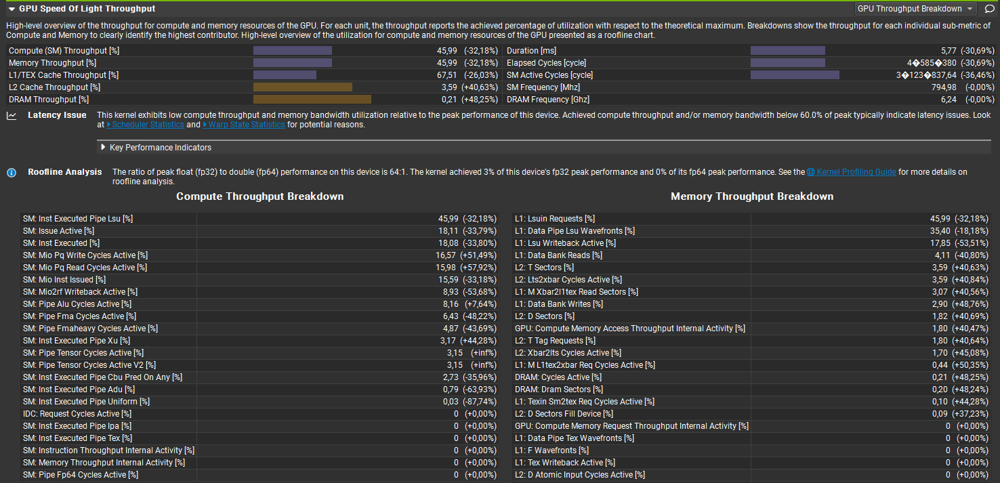
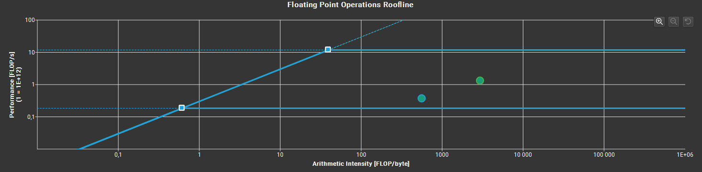
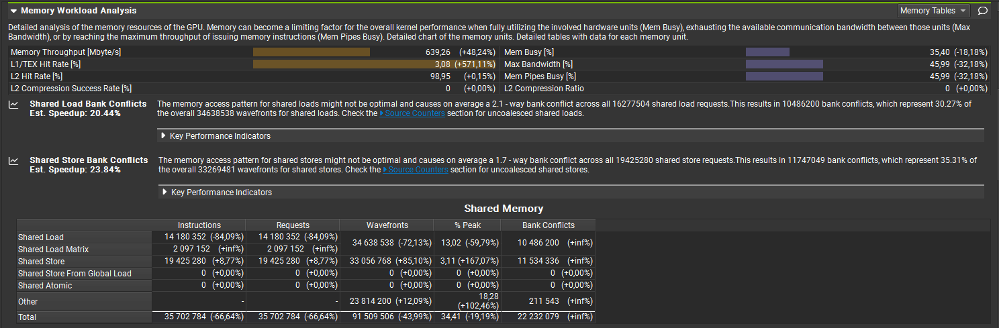
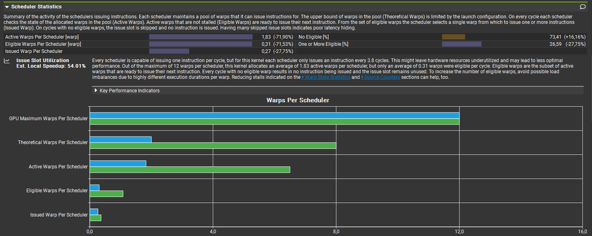
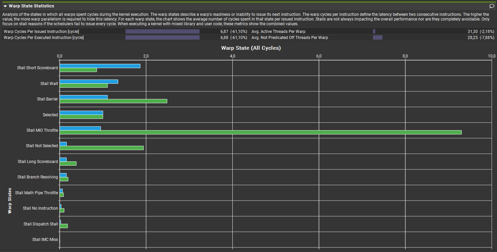
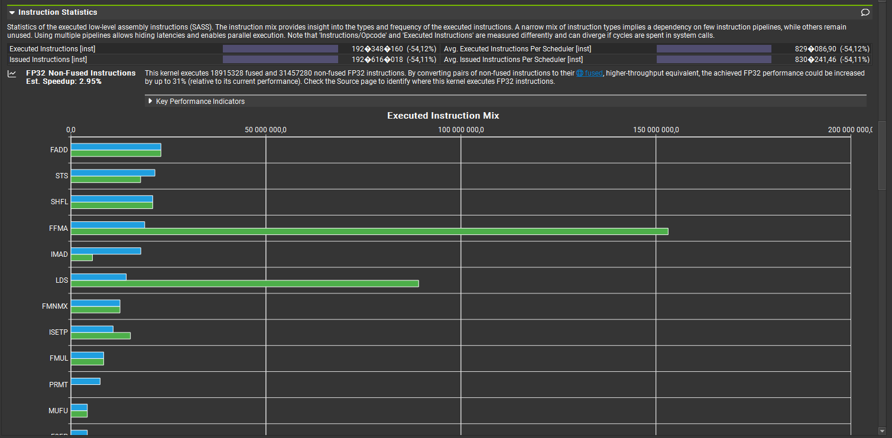
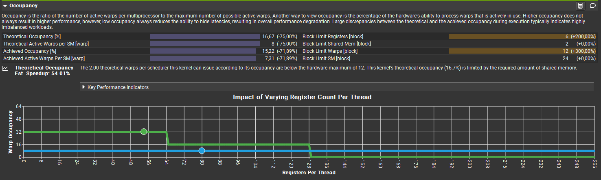
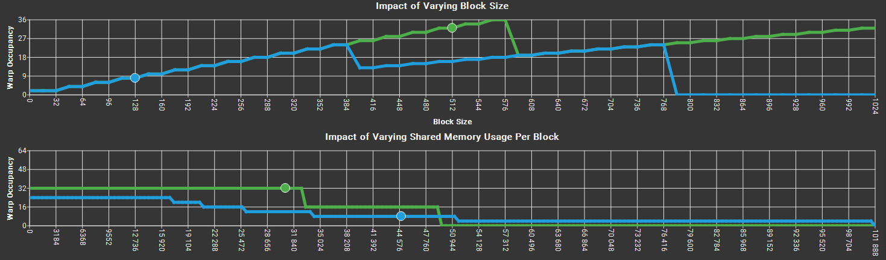
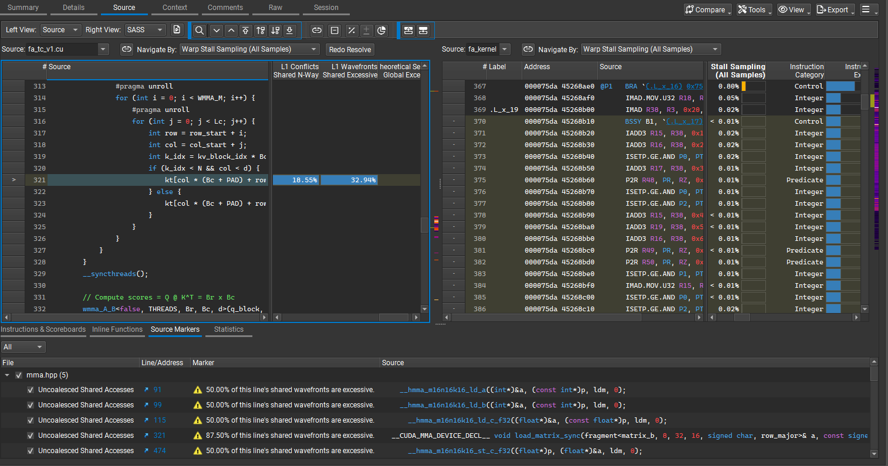

# Detailed Analysis of fa_tc_v1 in Nsight Compute

## Main Bottlenecks Detected 

### 1. Theoretical Occupancy — Est. Speedup: 54.01%

The 2.00 theoretical warps per scheduler this kernel can issue according to its occupancy are below the hardware maximum of 12. This kernel's theoretical occupancy (16.7%) is limited by the required amount of shared memory.

The memory access pattern for shared stores might not be optimal and causes on average a 1.7-way bank conflict across all 19,425,280 shared store requests. This results in 11,747,049 bank conflicts, which represent 35.31% of the overall 33,269,481 wavefronts for shared stores. Check the Source Counters section for uncoalesced shared stores.

**Metrics:**
- `l1tex__data_bank_conflicts_pipe_lsu_mem_shared_op_st.sum = 1.1747E+07` — decrease
- `l1tex__throughput.avg.pct_of_peak_sustained_active = 67.5074` — The higher the L1/TEX cache throughput, the more severe the issue becomes

### 3. Uncoalesced Shared Accesses — Est. Speedup: 22.16%

This kernel has uncoalesced shared accesses resulting in a total of 22,020,096 excessive wavefronts (33% of the total 67,684,352 wavefronts). Check the L1 Wavefronts Shared Excessive table for the primary source locations. The CUDA Best Practices Guide has an example on optimizing shared memory accesses.

**Metric:**
- `derived__memory_l1_wavefronts_shared_excessive = 2.20201E+07` — Reduce the number of excessive wavefronts in L1TEX

### 4. Low Utilization of Compute Pipelines — Est. Local Speedup: 88%

All compute pipelines are under-utilized. Either this workload is very small or it doesn't issue enough warps per scheduler. Check the Launch Statistics and Scheduler Statistics sections for further details.

**Metric:**
- `sm__pipe_alu_cycles_active.avg.pct_of_peak_sustained_active = 11.98` — Increase the utilization of the busiest pipeline (currently: ALU)

## Comparative Analysis

The baseline in the analysis below is `fa.cu`, the Flash Attention kernel without Tensor Cores.

### 1. Compute and Memory Throughput

Both compute and memory throughput have decreased, indicating the device is now even more underutilized despite improved latency. Below is the breakdown for both.

### 2. Roofline

The roofline analysis might suggest that the new kernel (blue dot) is inferior to the previous one (green dot).

### 3. Memory Workload

Additional evidence that memory resources are less strained, along with a new bottleneck emerging in bank conflicts.

### 4. Scheduler Statistics

Due to the kernel design (one warp owns WMMA_M = 16 rows of Q; one block comprises only 4 warps due to SRAM limitations), the number of theoretical warps per scheduler (4 schedulers per SM) decreases to 2. Number of blocks × Number of WarpsPerBlock = 2 × 4 = 8.

### 5. Warp State Statistics

Warp Cycles Per Issued instruction decreased by 61%, demonstrating the power of WMMA.
Notably, there was an interesting 90% collapse in the states: Stall MIO Throttle (9.3 cycles → 1 cycle) and Stall Not Selected (1.94 → 0.16).

### 6. Instruction Statistics

Executed instructions decreased by 54%, with the most significant decreases in:
- FFMA — FP32 Fuse Multiply Add
- LDS — Load with Shared Memory

### 7. Occupancy

Additional evidence of low occupancy due to kernel architecture.

SRAM usage would need to decrease from the current 44 KB to approximately 34 KB for more warps to be resident.

### 8. Source Counters

Branch instructions decreased by 63%; uncoalesced accesses account for 33% of the total wavefronts.

### 9. Source Code - Bank Conflicts

The line of code responsible for the most significant (33%) uncoalesced memory accesses:

