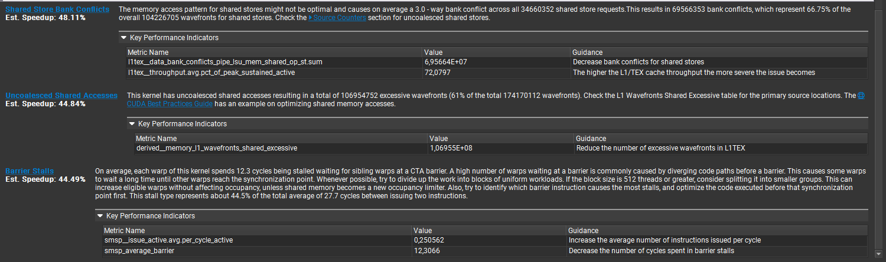
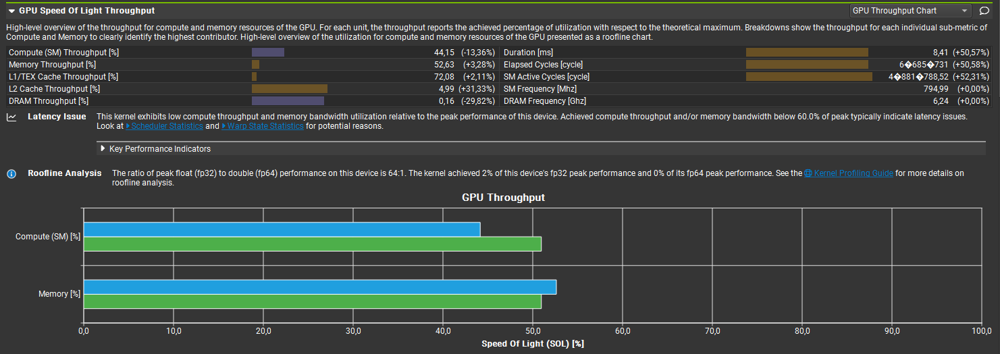
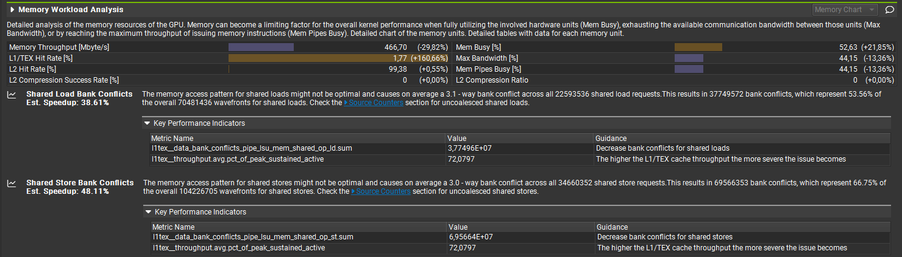
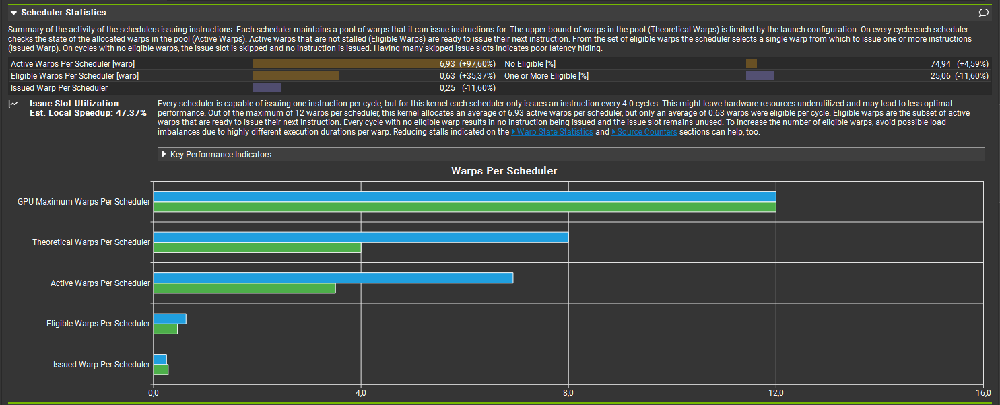
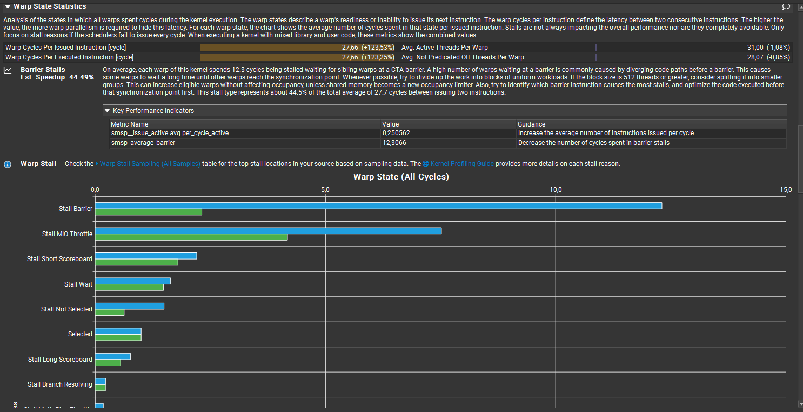
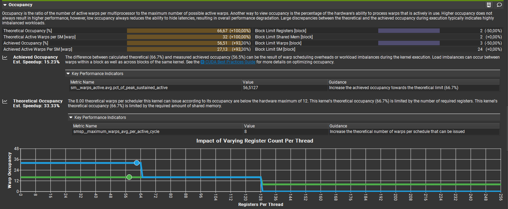
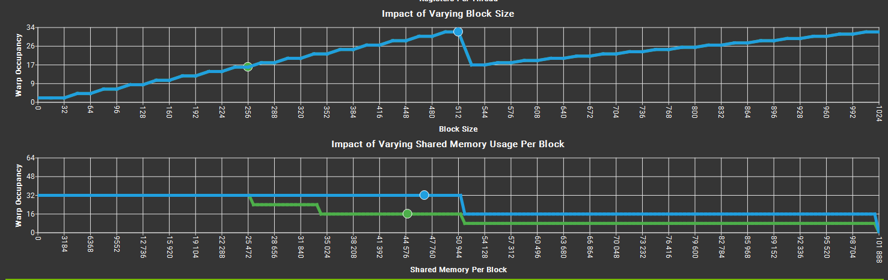
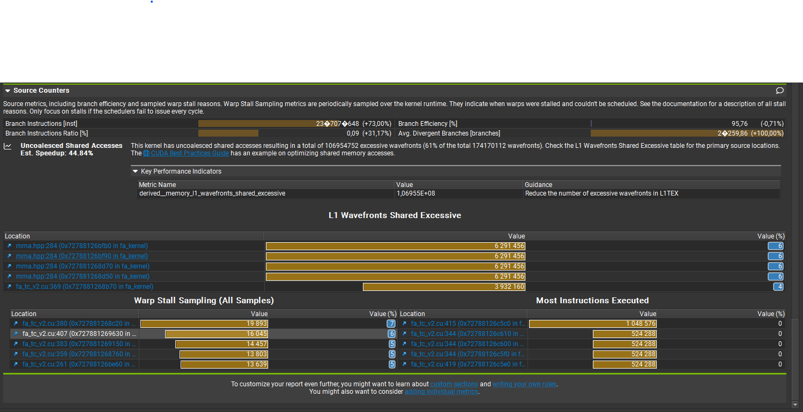

# Detailed Analysis — fa_tc_v1a vs fa_tc_v2 (Nsight Compute)

## Approach Overview

**Key Assumption:**  
Increase warp occupancy in the Br-dimension by using 8×32×16 WMMA tile size instead of 16×16×16. In this run we keep Br=64.

**Kernel Variants:**
- **fa_tc_v1a:** Single-warp owns 8xd of Q (no SRAM overflow with PAD=16)
- **fa_tc_v2:** Distribute warp work across d-dimension to two warps (SRAM overflow with PAD=16)

**Warp Work Distribution Strategy:**

1. Split Q@K^T work between two warps: one owns left half (d/2), the other owns right half (d/2)
   - With Br=64 and 8×32×16 tile size, this increases active warps from 8 to 16

2. Accumulate left and right partial results and sum them

3. SRAM requirements for accumulation buffers:
   - Q@K^T: 2 × Br × (d + PAD) ≈ 32 KB (PAD=32 for 8×32×16 tile alignment)
   - P@V: 2 × Br × (Bc + PAD) ≈ 32 KB
   - **Total impact:** Significant SRAM increase causes kernel overflow and silent failures

## Implementation Details

**Code Implementations:**
- **fa_tc_v1a** (`mha_kernels/fa_tc_v1a.cu`): Single warp owns 8×d of Q, PAD=16 (no SRAM overflow)
- **fa_tc_v2** (`mha_kernels/fa_tc_v2.cu`): Two warps own 8×d of Q, PAD=0 (causes SRAM overflow when PAD=16). Allocated SRAM per block with PAD=0 is c.a. 48 kB with configured SRAM size fo 102.4 kB. With PAD=16 the configured size likely drops down to c.a. 64kB, which results in the overflow.

**Bottleneck Visualization:**  

### Additional Validation Run

An extra run with **Br=32** (instead of 64), **4×2 = 8 warps** per block, **PAD=16** was conducted for **fa_tc_v2** to confirm that bank conflicts are reduced to zero with **PAD=16** and latency lowered to **7.5 ms**.

> Note: With **Br=16** this approach cannot be used due to SRAM overflow.

## Comparative Analysis

- **Compute vs Memory Throughput:**  
  Compute throughput decreased — bank conflicts negate the benefit of doubling warps. Memory throughput as a percentage of peak rose slightly, but absolute memory bandwidth (MB/s) fell ~30%.  
  

- **Bank Conflicts:**  
  ≈3‑way bank conflicts on both shared loads and stores, accounting for ~54–67% of affected wavefronts. These conflicts drive serialization and throughput loss.  
  

- **Scheduler Statistics:**  
  Active/theoretical warps roughly doubled as expected, but Eligible warps rose only ~35% and issued work decreased — indicating stalls or resource contention reducing effective issue rate.  
  

- **Warp State Statistics:**  
  Warp cycles per issued instruction increased >120%, driven by Stall Barrier and Stall MIO Throttle spikes. This explains much of the lost throughput.  
  

- **Occupancy:**  
  Occupancy increased ~100% when splitting work across the d‑axis. 
   
  
  Only ~5 KB of additional SRAM remains usable before occupancy drops by ~50% (SRAM pressure is tight).  
  

- **Source Counters:**  
  Large number of branch/source instructions attributable to uncoalesced shared accesses that map multiple threads to the same shared‑memory banks (causing bank conflicts and serialization). See source counter heatmap and code links for hotspots.  
  

## Notes

**Bug:** Mismatch with CPU test reference (Q, K, V initialized with 1.0)
- **Symptom:** Errors occurred at random output indices (including far indices)
- **Root cause:** Race condition in `online_softmax_and_accum_output()` — both left and right warps were writing to the same output indices simultaneously
- **Fix:** Added `if (warp_tile_col_id == 0)` guard and refactored accumulation logic

## Next Steps

- **Primary action:** Remove or mitigate shared-memory bank conflicts via re-indexing, padding adjustments, or swizzled access patterns
- **Secondary action:** Reduce SRAM pressure (minimize per-warp and shared memory allocations) to maintain high occupancy
- **Alternative approaches:**
  - (a) Preserve single-warp work on d-axis while optimizing shared memory access patterns
  - (b) If splitting work across d-axis, ensure padding and access layouts avoid bank hotspots
