# Detailed Analysis — fa_tc_v2 vs fa_tc_v2a (Nsight Compute)

## Goal

Remove bank conflicts via padding. Optimize SRAM usage in `fa_tc_v2a` to enable `PAD=8` or `PAD=16` (`PAD=32` still causes SRAM overflow):
- Move c_scratch buffer from fp to half
- Share the buffer for kt and values
- Share the buffer for q_block and scores_fp16 (half)
- Attempt sharing the buffer for scores and output (fp) in exact same way => bug with random incorrect kernel output values

Results: 
- SRAM allocation reduced by over 20%.
- Surprisingly PAD=8 (6.25ms) removed more bank conflicts than PAD=16 (6.8 ms)!

Also experimented with various swizzling strategies, which did not yield performance improvements. The least unfavorable variant is implemented in [fa_tc_v2b.cu](../../../mha_kernels/fa_tc_v2b.cu).

**Kernels:**
- **fa_tc_v2:**  [fa_tc_v2.cu](../../../mha_kernels/fa_tc_v2.cu), PAD = 0
- **fa_tc_v2a:** [fa_tc_v2a.cu](../../../mha_kernels/fa_tc_v2a.cu), PAD = 8

Both kernels use TC WMMA tile size `8×32×16` with `8 × 2 = 16` warps working independently over the `Br × d = 64 × 32` chunk of Q. The `d` dimension is split in two halves, distributed one per warp.

### Result

**Bank conflicts reduced by ~90%, latency improved from 8.3 ms to 6.25 ms.**

## Profiling results

### Bottlenecks

Exact barrier stall locations are identified in the Source Code section. Barriers will be removed in subsequent iterations wherever feasible.

Theoretical occupancy can only be increased by expanding the per-block input portion of Q (currently: `Br=64`, `d=32`, `h=32`), limited by SRAM availability. 
Given Tensor Core tile sizes and input dimensions, we cannot exceed 16 warps per block (32 warps per SM, 8 per scheduler). Increasing `Br` from 64 to 128 is infeasible as it would reduce the per-block SRAM limit from 2 to 1, decreasing occupancy.

SMSP workload imbalance is a secondary effect of the aforementioned bottlenecks.

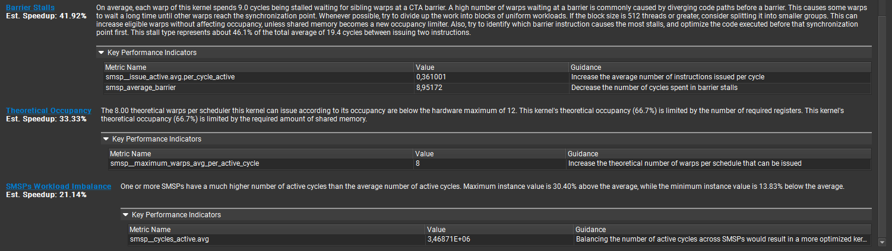

## Comparative Analysis

### Compute vs Memory Throughput

Duration improved by **25%**, with Compute and Memory Throughputs as percentage of peak both significantly elevated. 

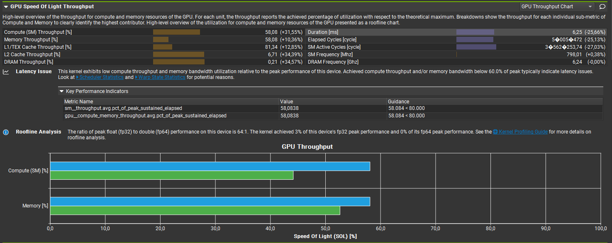

### Compute Workload

Instructions per cycle and SM utilization increased by **>40%**. Compute pipeline utilization improved across the board, particularly LSU (Load Store Unit) and ALU (Arithmetic Logic Unit).

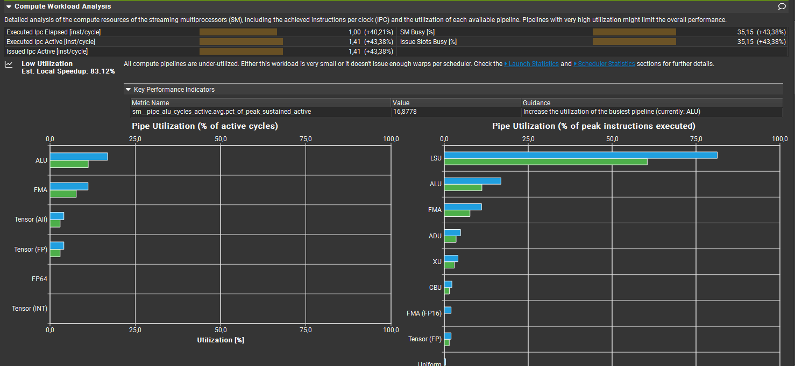

### Memory Workload and Bank Conflicts

Bank conflicts reduced by **88%**: **-94%** for shared loads and **-85%** for shared stores. Memory throughput increased by **35%**. 

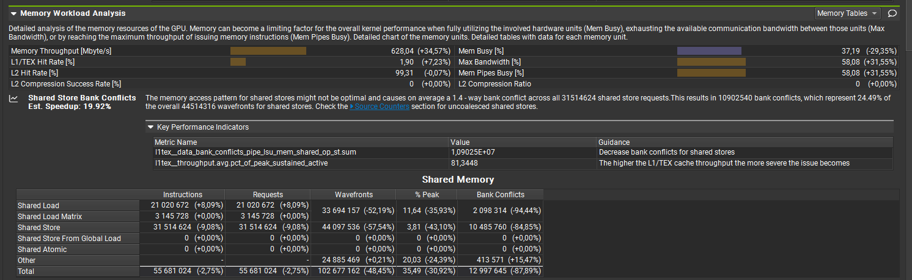

### Scheduler Statistics

Eligible warps increased by **50%** to nearly 1.0 (the critical threshold). The distribution of active cycles improved from **25%:75%** (1+ issued : 0 issued) to **36%:64%**, favoring instruction issuing.

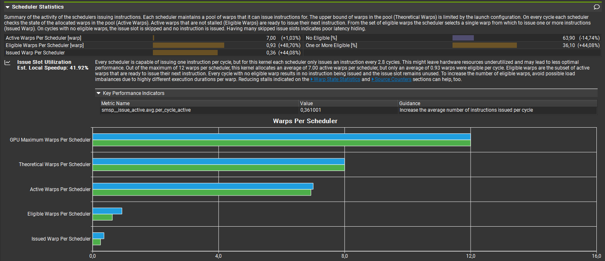

### Warp State Statistics

On average, each warp spends **9.0 cycles** stalled at CTA barriers, primarily due to the "left" warp performing final MMA result accumulation. Despite this, warp cycles per instruction decreased by **30%** due to reduced Barrier and MIO Throttle stall durations.

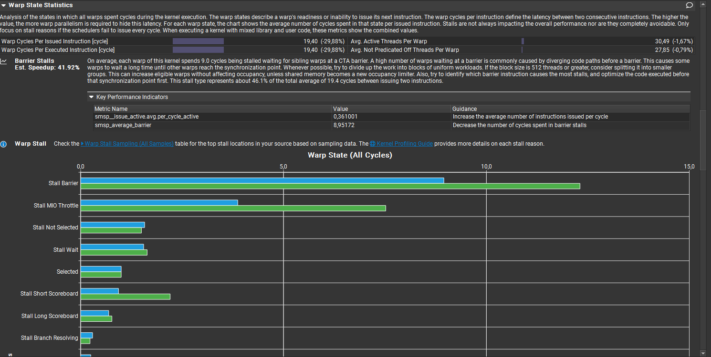

### Occupancy

Achieved Active Warps showed minimal improvement after bank conflict removal. Occupancy gains require expanding the per-block Q tile to increase theoretical warps per block/SM.

**Occupancy metrics:**

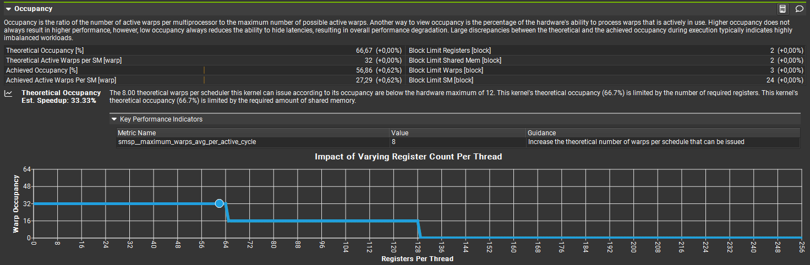

**SRAM usage reduction enabling padding:**

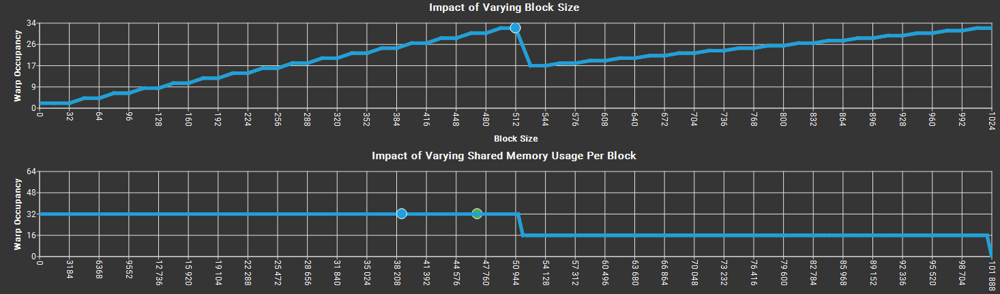

### Source Counters

Code locations responsible for remaining bank conflicts and warp stalls:

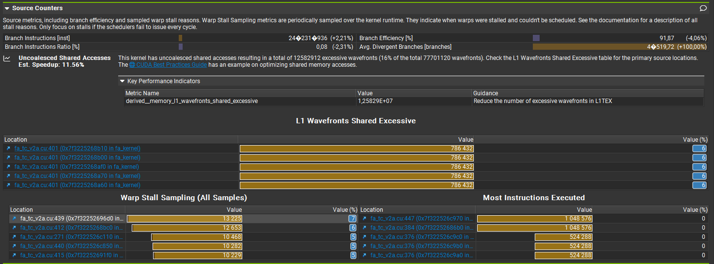

### Source Code Analysis

**Uncoalesced shared store (column-strided)** — will be optimized in the next iteration:

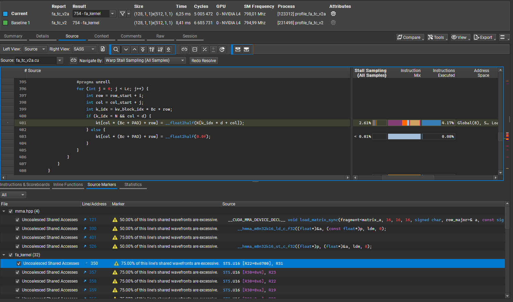

**Removable barrier** — Protected by static asserts for input dimensions and configuration:

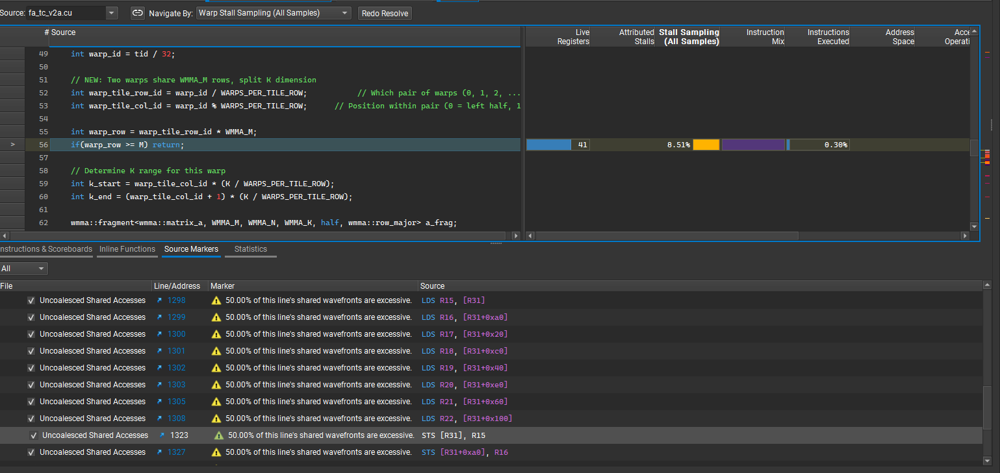

**Non-removable barrier** — Required when the "left" warp performs final addition of MMA results. With current warp-work distribution across the `d` dimension of Q, this barrier prevents race conditions and cannot be eliminated.

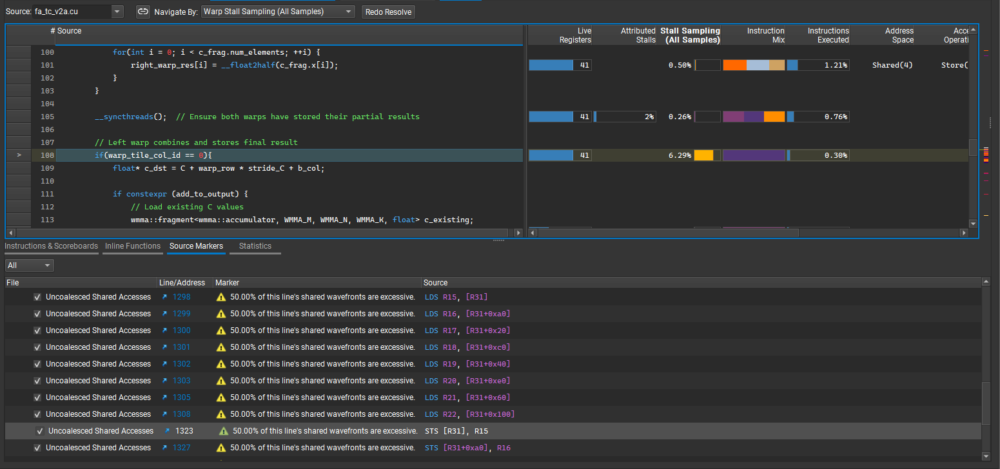

## Notes

- Tested on GPU hardware with sufficient SRAM for double-buffering across blocks
- Input dimensions constrained by static asserts: `Br=64`, `d=32`, `h=32`
- Bank conflict removal achieved via padding without register spilling
- Occupancy limited by SRAM constraints, not warp scheduler availability
- Increasing `Br` to 128 would reduce per-block SRAM limit from 2 to 1, decreasing occupancy

## Next Steps

- Optimize uncoalesced (column-strided) shared memory stores identified in Source Code section
- Remove barrier protected by static asserts for confirmed input dimensions
- Investigate additional swizzling strategies in `fa_tc_v2b` variant for further optimization
- Implement async shared memory operations to hide latency
- Implement `int8` quantization