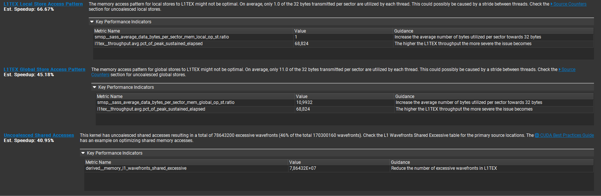
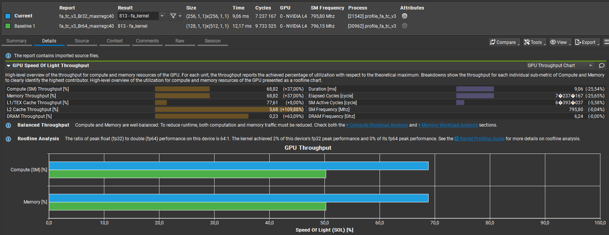
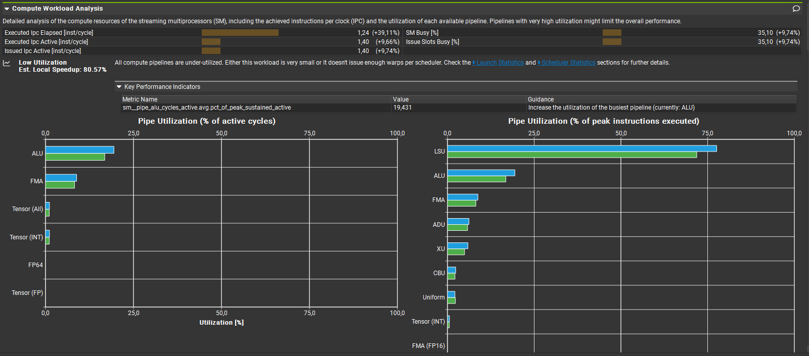
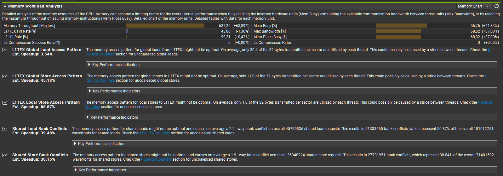
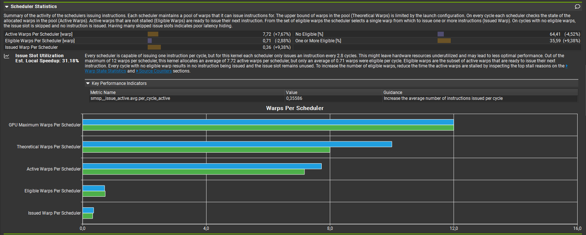
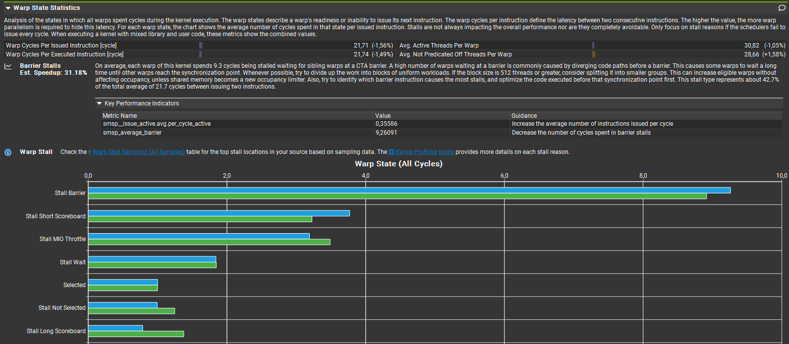
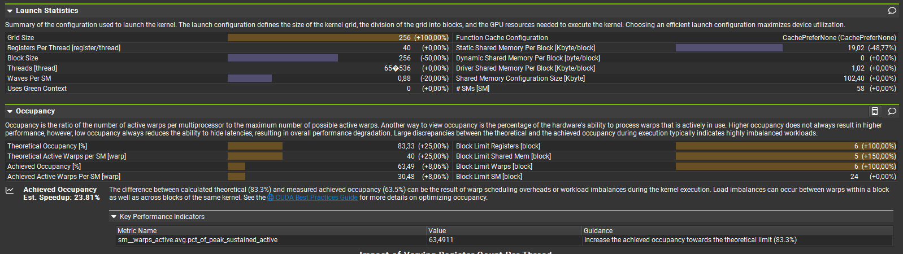
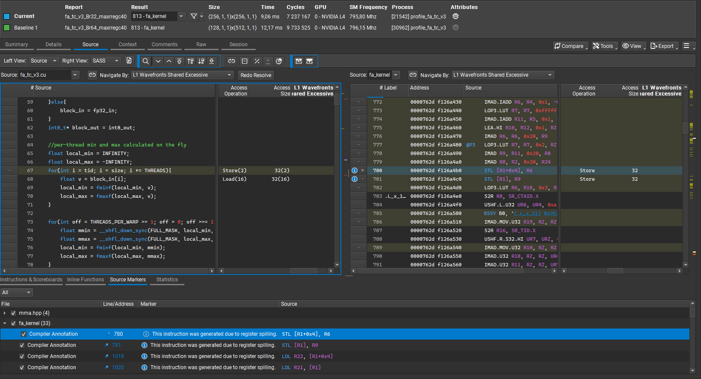
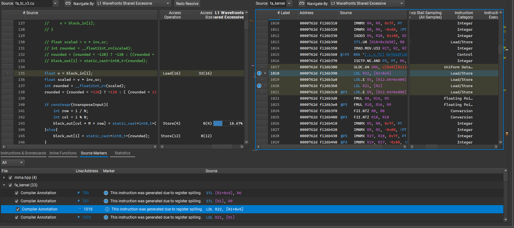
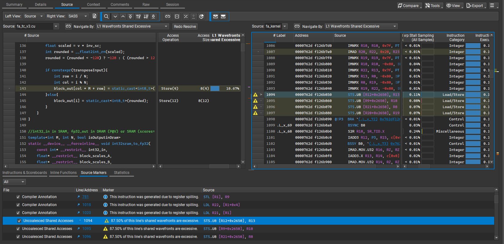

# Nsight Compute - Detailed Analysis

**Kernels profiled:** [fa_tc_int8_a.cu](../../../mha_kernels/fa_tc_int8_a.cu) in two settings: Br = 32 and Br = 64. Compiled with `-maxrregcount=40` to increase block residency per SM, which resulted in register spilling (noted in the Source Code section). 

## Goal

Compare two block-size strategies with similar theoretical occupancy:

- **Strategy 1 (Smaller):** Br=32 with 8 warps/block, enabling 5 blocks/SM
- **Strategy 2 (Larger):** Br=64 with 16 warps/block, enabling 2 blocks/SM

**Kernel Details**

Kernel: [fa_tc_int8_a.cu](../../../mha_kernels/fa_tc_int8_a.cu) with PAD = 0

Uses TC WMMA tile size `8×32×16`. Work is distributed across `Br × d` chunks of Q, with the `d` dimension split between warp tile rows:
- **Br=64:** 8 × 2 = 16 warps per block
- **Br=32:** 4 × 2 = 8 warps per block

### Result

**Winner: Br=32** — Superior end-to-end performance across all metrics:

| Metric | Br=32 | Br=64 | Advantage |
|---|---|---|---|
| **Duration** | 9.06 ms | 12.17 ms | **25% faster** |
| **Memory Throughput** | ≈69% | ≈50% | **38% higher** |
| **L2 Cache Throughput** | ≈5.7% | ≈2.7% | **2.1× higher** |

Br=64 is hindered by high shared-memory and register consumption per block, reducing resident blocks/SM and amplifying load imbalance.

## Profiling results

### Bottlenecks

NCU flags opportunities related to sector utilization and memory coalescing. Fundamental architectural constraints limit further gains:

**Root Causes:**
- **Synchronization pattern:** `if(warp_tile_col_id==0)` barriers (4 locations) required for race-condition safety during per-warp result accumulation — cannot be removed
- **SRAM pressure:** Padding experiments reduced block count from 5 to 4 blocks/SM, degrading occupancy
- **Memory access patterns:** Require algorithm redesign or memory swizzling (in progress)

Padding configurations were tested and did not improve overall performance.

## Comparative Analysis

### Compute vs Memory Throughput

**Latency:** Br=32 executes in **9.06 ms** vs **12.17 ms** for Br=64 (≈25% speedup).

**Throughput improvement:** Both compute and memory throughput increase from ≈50% to ≈69%. The high L2 hit rate and increased L2 cache throughput (≈2.7% → 5.7%) enable the observed performance gain.

### Compute Workload

Slight ≈10% workload improvement across the available pipelines.

### Memory Workload and Bank Conflicts

**Key findings:**
- **Memory throughput:** Br=32 is **≈63% higher** than Br=64, directly improving runtime
- **L2 cache efficiency:** Hit rate is very high (~100%)
- **Interconnect activity:** Both `Mem Busy [%]` and `Max Bandwidth [%]` increase by ≈18 percentage points

**Remaining bottlenecks:**
1. Kernel synchronization (`if(warp_tile_col_id==0`) for per-warp result accumulation
2. SRAM pressure — target is 5 blocks/SM residency

### Scheduler Statistics

**Theoretical warps:** Br=32 supports **10 warps** (+25%) versus 8 for Br=64, due to higher block residency. However, increased theoretical capacity yields modest actual improvements:

- **Active warps:** +8%
- **Issued warps:** +9%
- **Eligible warps:** −3% (counterintuitive)

### Warp State Statistics

Negligible changes in Warp State Statistics - the barriers still dominate.

### Occupancy

**Benefits of smaller blocks (Br=32):**
1. ~2× larger grid (256 vs 128 blocks)
2. ≈50% less SRAM pressure per block
3. Higher block-limit counts: **6** registers, **5** SRAM → increased theoretical occupancy

**Trade-off:** Waves per SM drop below 1.0 (≈0.88 = 256 / (5 × 58)), reducing GPU's latency-hiding capacity. Additionally, fewer resident blocks per SM increases SM load imbalance risk (see high-level analysis).

**Net occupancy change:** Achieved occupancy improves by ~8%, while theoretical increases by ~25%.

### Source Code Analysis

**Register spilling:** Evidence visible in compiled code due to `-maxrregcount=40`, which caps per-thread registers to enable 5 blocks/SM residency.

**Uncoalesced SRAM writes:** Present but a smaller bottleneck than uncoalesced global reads. An extra SRAM buffer was attempted to eliminate these writes; however, increased SRAM pressure reduced block residency, offsetting the benefit.

## Notes

**Compilation trade-off:** `-maxrregcount=40` was applied to increase block residency at the cost of register spilling. While this improves occupancy metrics, it incurs additional register-to-SRAM load/store overhead.

**Interpretation:** "Block limit" metrics report per-block resource constraints (registers, SRAM, and warps) and must be read alongside scheduler and warp-state statistics to understand actual kernel behavior.

**Synchronization overhead:** The `if(warp_tile_col_id==0` pattern introduces unavoidable synchronization stalls that limit warp efficiency and represent a fundamental architectural constraint of this design.

## Next Steps

**Objective:** Apply Int8 quantization to the base `fa_tc_v1` kernel variant.

**Rationale:** The `fa_tc_v1` variant achieved the best latency to date *without* the warp-barrier stall that appears in the 2-warps-per-file-row approach. Applying Int8 to this cleaner architecture should yield clear latency and resource-usage improvements.

**Plan:** Implement the Int8 path and re-profile with Nsight Compute to measure latency, occupancy, memory behavior, and identify next optimization cycles.
