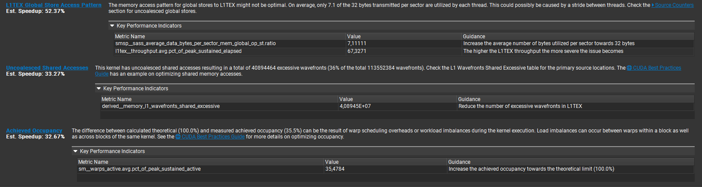
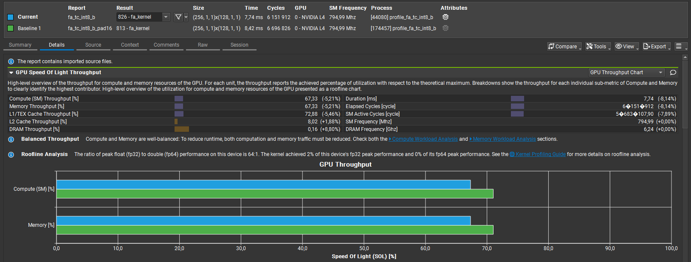
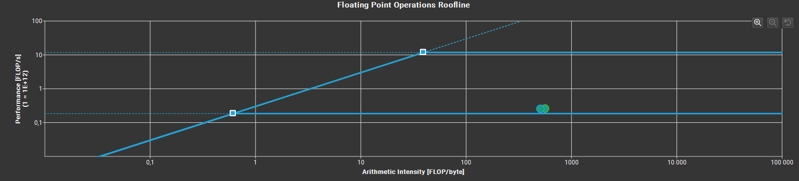
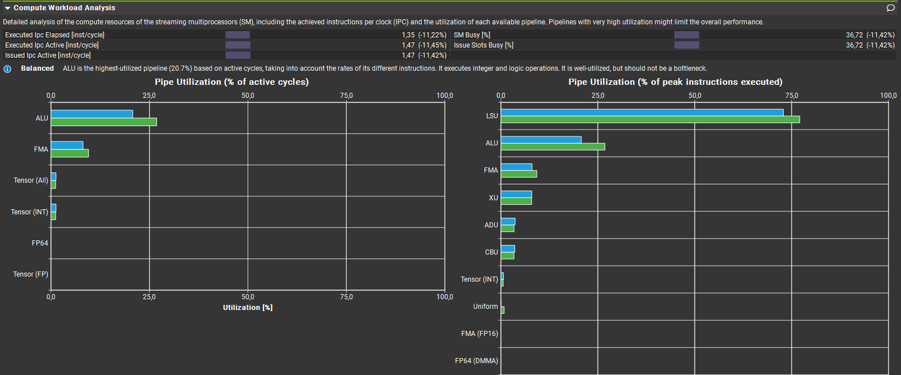
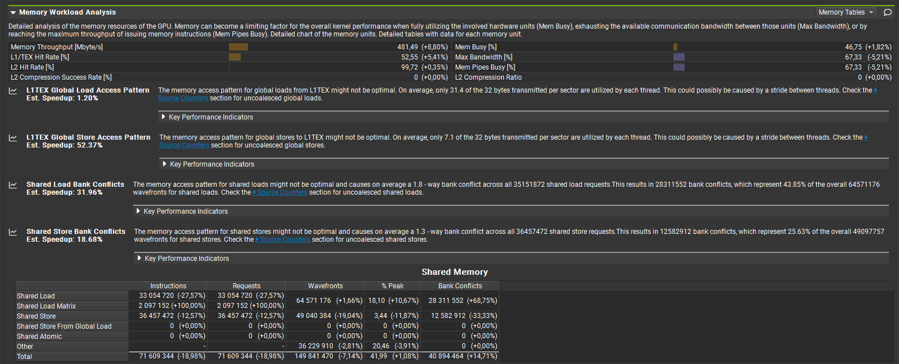
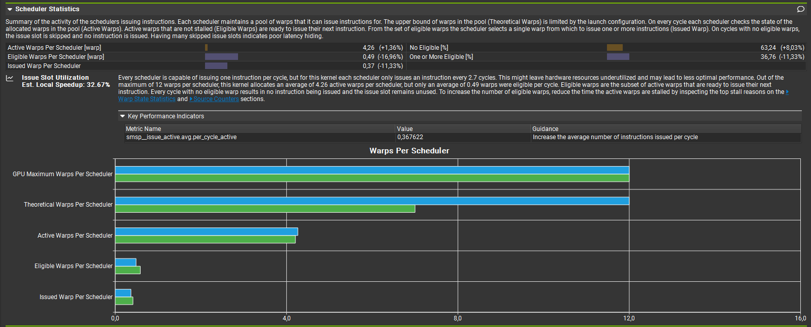
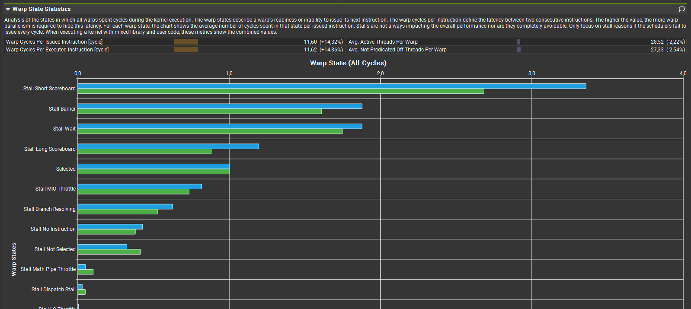
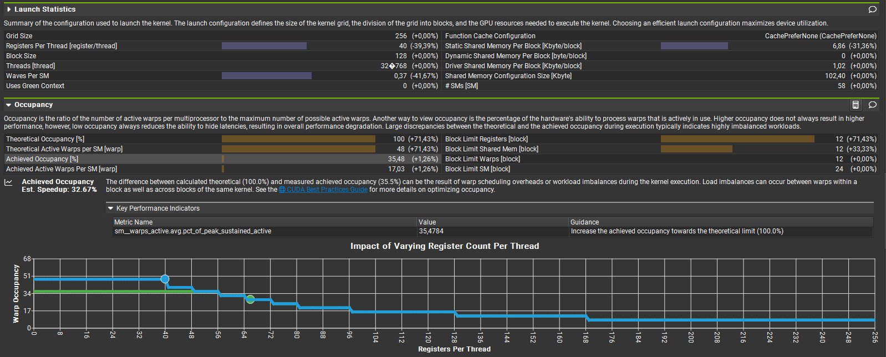
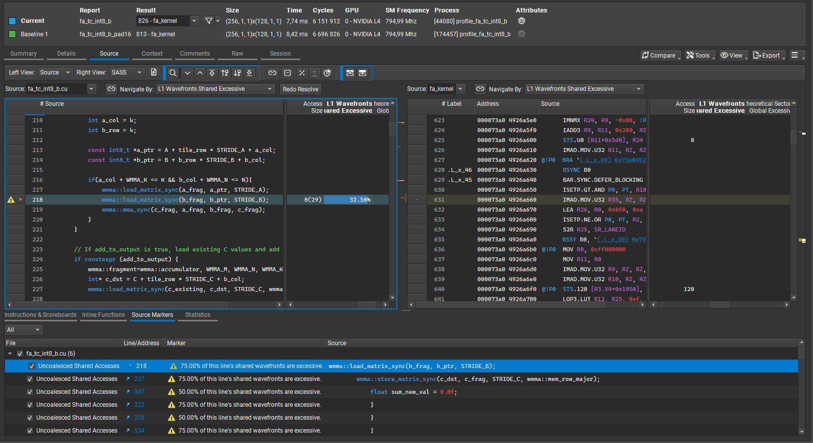
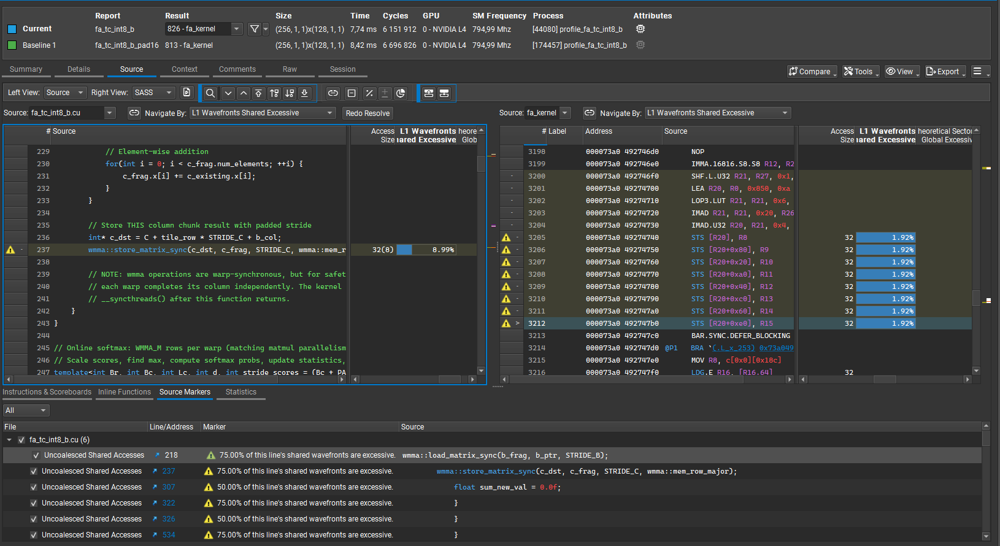

# Nsight Compute - Detailed Analysis

**Kernels profiled:** [fa_tc_int8_b.cu](../../../mha_kernels/fa_tc_int8_b.cu) in two configurations.

## Goal

Compare two kernel versions:
1. Unoptimized for register pressure (PAD = 16)
2. Optimized for register pressure (PAD = 0)

## Kernel Details

Kernel: [fa_tc_int8_b.cu](../../../mha_kernels/fa_tc_int8_b.cu) with `PAD = 0`.

Uses WMMA tile size `8×32×16`. Work is distributed across `Br × d` chunks of Q; each warp owns `8 × d` of Q.

### Result


## Before profiling

### 1. SRAM optimization

The first step, prior to a detailed Nsight Compute analysis, was SRAM optimization to increase occupancy. Below is the shared-memory allocation state before and after the change.

#### BEFORE

```cpp
    __shared__ __align__(16) int8_t q_block[Br * (d + PAD)];
    __shared__ __align__(16) int8_t kt[d * (Bc + PAD)];

    __shared__ float scores_fp32[Br * (Bc + PAD)];
    __shared__ int scores_int32[Br * (Bc + PAD)];
    __shared__ __align__(16) int8_t scores_int8[Br * (Bc + PAD)];

    __shared__ int temp_output_int32[Br * (Bc + PAD)];
    __shared__ float output[Br * (d + PAD)];

    __shared__ __align__(16) int8_t values[Bc * (d + PAD)];

    __shared__ float sum_exp[Br];
    __shared__ float max_prev[Br];
    __shared__ float max_curr[Br];
```

Allocation:

| Buffer | Dimensions | Data Type | Size |
|---|---:|---|---:|
| `q_block` | 32 × 32 | `int8_t` | 1,024 B |
| `kt` | 32 × 32 | `int8_t` | 1,024 B |
| `scores_fp32` | 32 × 32 | `float` | 4,096 B |
| `scores_int32` | 32 × 32 | `int` | 4,096 B |
| `scores_int8` | 32 × 32 | `int8_t` | 1,024 B |
| `temp_output_int32` | 32 × 32 | `int` | 4,096 B |
| `output` | 32 × 32 | `float` | 4,096 B |
| `values` | 32 × 32 | `int8_t` | 1,024 B |
| `sum_exp` | 32 | `float` | 128 B |
| `max_prev` | 32 | `float` | 128 B |
| `max_curr` | 32 | `float` | 128 B |
| **Total** | | | **20,864 B** |

#### AFTER

```cpp
    __shared__ __align__(16) union{
        int8_t q_block[Br * (d + PAD)];
        int8_t scores[Br * (Bc + PAD)];
    } int8_union_buffer;

    int8_t* q_block = int8_union_buffer.q_block;
    int8_t* scores_int8 = int8_union_buffer.scores;

    __shared__ __align__(16) union{
        int8_t kt[Bc * (d + PAD)];
        int8_t values[Bc * (d + PAD)];
    } int8_union_buffer_2;

    int8_t* kt = int8_union_buffer_2.kt;
    int8_t* values = int8_union_buffer_2.values;

    __shared__ __align__(16) union{
        float scores_fp32[Br * (Bc + PAD)];
        int scores_int32[Br * (Bc + PAD)];
        int temp_output[Br * (d + PAD)];
        float output[Br * (d + PAD)];
    } shared_temp_buffer;

    float* output = shared_temp_buffer.output;

    float* scores_fp32 = shared_temp_buffer.scores_fp32;
    int* scores_int32 = shared_temp_buffer.scores_int32;
    int* temp_output_int32 = shared_temp_buffer.temp_output;

    __shared__ float sum_exp[Br];
    __shared__ float max_prev[Br];
    __shared__ float max_curr[Br];
    __shared__ float max_new[Br];
    __shared__ float sum_new[Br];
    __shared__ float exp_max_diff[Br];
```

Allocation:

| Buffer | Dimensions | Data Type | Size |
|---|---:|---|---:|
| `int8_union_buffer` (union of `q_block` / `scores`) | 32 × 32 | `int8_t` | 1,024 B |
| `int8_union_buffer_2` (union of `kt` / `values`) | 32 × 32 | `int8_t` | 1,024 B |
| `shared_temp_buffer` (union of scores/output variants) | 32 × 32 | `float` / `int` | 4,096 B |
| `sum_exp` | 32 | `float` | 128 B |
| `max_prev` | 32 | `float` | 128 B |
| `max_curr` | 32 | `float` | 128 B |
| `max_new` | 32 | `float` | 128 B |
| `sum_new` | 32 | `float` | 128 B |
| `exp_max_diff` | 32 | `float` | 128 B |
| `warp_maxs` (in `fp32_to_int8sram`) | 4 | `float` | 16 B |
| `warp_mins` (in `fp32_to_int8sram`) | 4 | `float` | 16 B |
| `inv_sc_shared` (in `fp32_to_int8sram`) | 1 | `float` | 4 B |
| **Total** |  |  | **6,948 B** |

### 2. Register optimization

After aggressive SRAM optimizations, register pressure became the bottleneck for block concurrency (initially allowing a maximum of 5 blocks per SM). Key mitigations:

- Move `max_new`, `sum_new`, `exp_max_diff` into shared memory within `online_softmax` (previously contributed 3×8 = 24 floats per thread).
- Remove `#pragma unroll` where it increased register pressure.
- Replace `__forceinline__` with `noinline` for large device helpers where appropriate. (`__forceinline__` reduces call overhead but can increase register pressure; `noinline` may reduce registers used by the caller. No measurable runtime improvement was observed from changing inline attributes.)
- Use `__launch_bounds__(THREADS, 2)` to guide the compiler's register allocation strategy — modest perf improvement (~1%).
- Passing `-maxregcount` did not reduce registers per thread after `__launch_bounds__` tuned the allocation; verified with PTXAS output (no spilling).


#### PTXAS build summary (fa_tc_int8_b)

Build command used:

```bash
nvcc -O3 -lineinfo -Xcompiler -Wall --ptxas-options=-v -gencode arch=compute_89,code=sm_89 -gencode arch=compute_89,code=compute_89 -I. -I./include  drivers/main.cu inputs/data.cu utils/verify.cu mha_kernels/fa_tc_int8_b.cu -o bin/profile_fa_tc_int8_b
```

PTXAS output (excerpt):

```
ptxas info    : 0 bytes gmem
ptxas info    : 0 bytes gmem
ptxas info    : 0 bytes gmem
ptxas info    : 267 bytes gmem, 40 bytes cmem[4]
ptxas info    : Compiling entry function '_Z9fa_kernelILi32ELi32ELi32ELi1EEvPKfS1_S1_PfS2_iif' for 'sm_89'
ptxas info    : Function properties for _Z9fa_kernelILi32ELi32ELi32ELi1EEvPKfS1_S1_PfS2_iif
	0 bytes stack frame, 0 bytes spill stores, 0 bytes spill loads
ptxas info    : Used 40 registers, used 1 barriers, 6864 bytes smem, 404 bytes cmem[0], 16 bytes cmem[2]
ptxas info    : Compiling entry function '_Z10concat_matILi16EEvPfPKfiiiiii' for 'sm_89'
ptxas info    : Function properties for _Z10concat_matILi16EEvPfPKfiiiiii
	0 bytes stack frame, 0 bytes spill stores, 0 bytes spill loads
ptxas info    : Used 8 registers, used 0 barriers, 392 bytes cmem[0]
ptxas info    : Compiling entry function '_Z11extract_matILi16EEvPKfPfiiiiii' for 'sm_89'
ptxas info    : Function properties for _Z11extract_matILi16EEvPKfPfiiiiii
	0 bytes stack frame, 0 bytes spill stores, 0 bytes spill loads
Built: bin/profile_fa_tc_int8_b (kernel=fa_tc_int8_b, arch=sm_89)
```


## Profiling results

The results below are from Nsight Compute after the SRAM and register optimizations. The baseline for comparisons is the unoptimized kernel with `PAD = 16`.

### Bottlenecks

The largest remaining bottlenecks:

- Uncoalesced global store via `wmma::store_matrix_sync` — estimated speedup: 52%
- Uncoalesced shared access via `wmma::load_matrix_sync` — estimated speedup: 33%
- Achieved occupancy — estimated speedup: 33% (achieved occupancy is ~35% despite theoretical occupancy reaching 100%)



## Comparative Analysis

### Compute vs Memory Throughput

Overall duration decreased slightly while both compute and memory throughput also reduced slightly; this is consistent with the optimization trade-offs.



### Roofline / Compute Workload

The kernel remains compute-bound.



### Instructions per Cycle (IPC)

IPC decreased by ~11%, which is a regression.



### Memory Workload and Bank Conflicts

You can see that bank-conflict counts increased by ~15% relative to the padded kernel. Memory throughput (MB/s) and L1 hit rate improved, which partially offset the impact of additional bank conflicts.



### Scheduler Statistics

The primary goal of the SRAM and register-pressure optimizations was to increase occupancy. Theoretical warps increased to the hardware limit (12 warps per scheduler per SM), but Active Warps increased only marginally (~1%) while Eligible and Issued decreased. The drop in Eligible (≈0.6 → 0.5) at these low levels can significantly affect performance.



### Warp State Statistics

Warps show increased stall/wait cycles after the changes, indicating higher latency between dependent instructions across several warp states.



### Occupancy & Launch

Register-related metrics (Registers per Thread and Block Limit Registers) indicate the compiler selected an optimal register count guided by `__launch_bounds__`. However, the reduction in warp waves likely explains why Achieved Occupancy did not materially increase.



### Source Code Analysis

Below are the largest contributors to the uncoalesced global/shared-access bottlenecks:





## Notes

(Observations and raw notes.)

## Next Steps

- Investigate `wmma::store_matrix_sync` store pattern for coalescing opportunities.
- Revisit the store/load layout and possible bank-swizzle strategies.
- Explore finer-grained tiling or reordering to reduce IPC regressions.


## Extra notes

1. For occupancy, what matters is warps per SM, not warps per block.

2. Padding (clarification):

     - Padding is required only in SRAM buffers. Output destinations for WMMA operations (for example `q_block`, `scores_int8`, `kt`, `values`) should be padded for alignment and to reduce bank conflicts.
     - DRAM inputs (`Q`, `K`, `V`) are raw `[N, d]` layouts and do not require padding; only add padding when writing to SRAM.

3. Debugging races when aliasing SRAM buffers

3.1 Find shared-memory hazards (test with small N, e.g. N=64)

```bash
compute-sanitizer --tool racecheck --racecheck-report all --racecheck-detect-level info \
    --show-backtrace yes --force-blocking-launches --kernel-name kns=fa_kernel \
    ./bin/profile_fa_tc_int8_b --warmup=0 --runs=1
```

3.2 Find bad barrier usage

```bash
compute-sanitizer --tool synccheck --show-backtrace yes --force-blocking-launches \
    ./bin/profile_fa_tc_int8_b --warmup=0 --runs=1
```

3.3 Find reads of uninitialized memory

```bash
compute-sanitizer --tool initcheck --show-backtrace yes --force-blocking-launches \
    ./bin/profile_fa_tc_int8_b --warmup=0 --runs=1
```